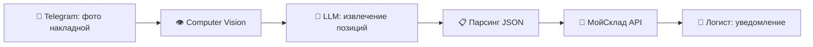
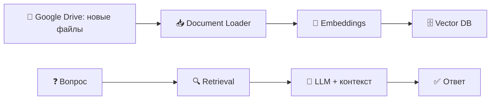

# 🤖 AI Automation Engineer — Portfolio

Практические проекты по внедрению AI-агентов, RAG-систем и автоматизации бизнес-процессов на **n8n** и **Make**.

> Открыт к позициям: AI Integration Specialist, AI Automation Engineer, AI Solutions Engineer.

---

## 🛠 Core Stack

| Категория | Инструменты |
|---|---|
| **Automation** | n8n, Make |
| **AI / LLM** | OpenAI, Anthropic, DeepSeek, OpenRouter, self-hosted LLM (llama.cpp) |
| **RAG / Search** | Vector DB, Embeddings, Google Drive auto-sync |
| **Integrations** | Telegram Bot API, Google Calendar, Google Drive, МойСклад, Slack, PostgreSQL |
| **Dev Tools** | Docker, ngrok, REST API, Webhooks, Node.js, Python |

---

## 🚀 Projects

### 1. 📦 Telegram + МойСклад: Computer Vision оприходование
Автоматизация приёмки товаров по фото накладной.



**Бизнес-результат:** ручной ввод сокращён с ~40 мин до 2 мин, исключены ошибки ручного ввода.

[📄 workflow.json](workflows/n8n/telegram-moysklad-cv.json)

---

### 2. 🧠 RAG AI Agent с автообновляемой базой знаний
AI-агент отвечает на вопросы по внутренним документам компании.



**Ключевое:** база знаний обновляется автоматически при добавлении документов в Google Drive.

[📄 workflow.json](workflows/n8n/rag-ai-agent.json)

---

### 3. ✈️ AI Travel Consultant (Telegram-бот)
AI-консультант для турагентства с памятью диалога (PostgreSQL).

- Персонализированный подбор направлений
- Память предпочтений клиента между сессиями
- Строгие границы компетенции (не отвечает на вопросы вне туризма)
- Системный промпт с генерацией travel-фактов

[📄 workflow.json](workflows/n8n/tg-ai-travel-consultant.json)

---

### 4. 📞 SWOT-анализ телефонных звонков (Make)
Автоматический анализ качества общения менеджеров с клиентами.

- Загрузка аудио → транскрибация
- LLM-анализ диалога по чек-листу критериев
- SWOT-отчёт + рекомендации
- Триггер: новый файл в Google Drive

[📄 blueprint.json](workflows/make/swot-call-analysis.json)

---

### 5. 👨‍💼 AI Sales Manager с БД
Локальный AI-ассистент для отдела продаж на self-hosted LLM (llama.cpp).

- Классификация запросов через локальную модель
- Хранение клиентских данных
- Обработка заявок и консультаций

[📄 workflow.json](workflows/n8n/ai-sales-manager.json)

---

### 6. ✍️ AI Генерация описаний товаров
Автоматизация контент-менеджмента: генерация маркетинговых описаний через Telegram-бота.

- Валидация входных данных
- Multiple варианты описания
- Обратная связь и доработка

[📄 workflow.json](workflows/n8n/ai-product-descriptions.json)

---

### 7. 📋 Автоматизация экзаменации кандидатов (без AI)
Классическая автоматизация онбординга: тестирование сотрудников после изучения регламентов.

- Открытые и закрытые вопросы
- Автопроверка + HR approval для открытых ответов
- Slack-уведомления, контроль сроков

[📄 workflow.json](workflows/n8n/candidate-examination.json)

---

### 8. 📅 AI Personal Assistant для Google Calendar
Telegram-бот для управления расписанием через Google Calendar API.

- Создание событий голосом/текстом
- Автоматические напоминания
- NLP-парсинг дат и времени

[📄 workflow.json](workflows/n8n/google-calendar-assistant.json)

---

### 9. 🔬 RAG с векторной БД через ngrok
Экспорт RAG-системы наружу через ngrok для демонстрации заказчику.

[📄 workflow.json](workflows/n8n/rag-vectordb-ngrok.json)

---

## 📂 Repository Structure

```
.
├── README.md
├── SETUP.md                  ← Инструкции по запуску
├── index.html                ← Лендинг-портфолио
├── workflows/
│   ├── n8n/
│   │   ├── telegram-moysklad-cv.json
│   │   ├── rag-ai-agent.json
│   │   ├── tg-ai-travel-consultant.json
│   │   ├── ai-product-descriptions.json
│   │   ├── ai-sales-manager.json
│   │   ├── candidate-examination.json
│   │   ├── google-calendar-assistant.json
│   │   └── rag-vectordb-ngrok.json
│   └── make/
│       └── swot-call-analysis.json
└── screenshots/              ← Скриншоты рабочих систем
```

---

## 💼 Business Value

✅ Сокращение ручных операций  
✅ Исключение ошибок ручного ввода  
✅ Ускорение обработки документов  
✅ Автоматизация клиентских коммуникаций  
✅ Внедрение AI в реальные бизнес-сценарии  
✅ Self-hosted решения (данные не покидают контур компании)  

---

## 📬 Contact

- Telegram: [@Firesafety76](https://t.me/Firesafety76)
- GitHub: [Firesafety37](https://github.com/Firesafety37)
