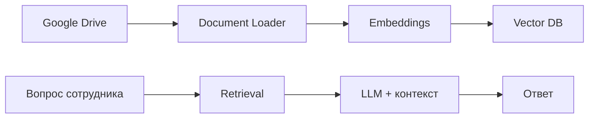

# RAG Knowledge Base Agent

## Бизнес-проблема
Сотрудники тратят время на поиск ответов в регламентах, инструкциях и документах Google Drive. Знания есть, но их сложно быстро найти.

## Решение
AI-агент автоматически обновляет базу знаний из Google Drive: загружает документы, строит embeddings, сохраняет их в vector DB и отвечает на вопросы с контекстом из корпоративных материалов.

## Архитектура

## Интеграции
- n8n
- Google Drive
- OpenAI embeddings / LLM
- Vector DB
- PostgreSQL / Supabase nodes

## Бизнес-результат
- Снижение нагрузки на поддержку, HR и руководителей.
- Быстрый доступ к знаниям без ручного поиска по файлам.
- База знаний обновляется при добавлении новых документов.

## Workflow
[Открыть JSON](../workflows/n8n/rag-ai-agent.json)
