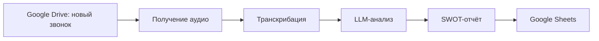

# SWOT-анализ телефонных звонков

## Бизнес-проблема
Руководителю сложно регулярно проверять качество коммуникации менеджеров: прослушивание звонков занимает много времени, а обратная связь часто запаздывает.

## Решение
Make-сценарий отслеживает новые аудиофайлы в Google Drive, транскрибирует звонок, анализирует диалог через LLM по SWOT/чек-листу и сохраняет результат в таблицу.

## Архитектура

## Интеграции
- Make
- Google Drive
- Speech-to-text
- LLM
- Google Sheets

## Бизнес-результат
- Автоматизация контроля качества продаж.
- Быстрая обратная связь менеджерам.
- Единая таблица с результатами анализа и рекомендациями.

## Workflow
[Открыть blueprint](../workflows/make/swot-call-analysis.json)
