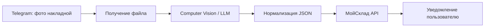

# Telegram + МойСклад: CV-оприходование

## Бизнес-проблема
Приёмка товаров по накладным требует ручного переноса позиций в складскую систему. Это медленно и даёт ошибки в номенклатуре, количестве и цене.

## Решение
Workflow принимает фото накладной в Telegram, получает файл через Telegram API, передаёт изображение в CV/LLM, нормализует позиции в JSON и создаёт документы/позиции через API МойСклад.

## Архитектура

## Интеграции
- Telegram Bot API
- n8n
- LLM / Computer Vision
- МойСклад API
- HTTP Request / Code nodes

## Бизнес-результат
- Ручной ввод сокращается примерно с 40 минут до 2 минут.
- Меньше ошибок при переносе данных.
- Сотрудник работает через привычный интерфейс Telegram.

## Workflow
[Открыть JSON](../workflows/n8n/telegram-moysklad-cv.json)
